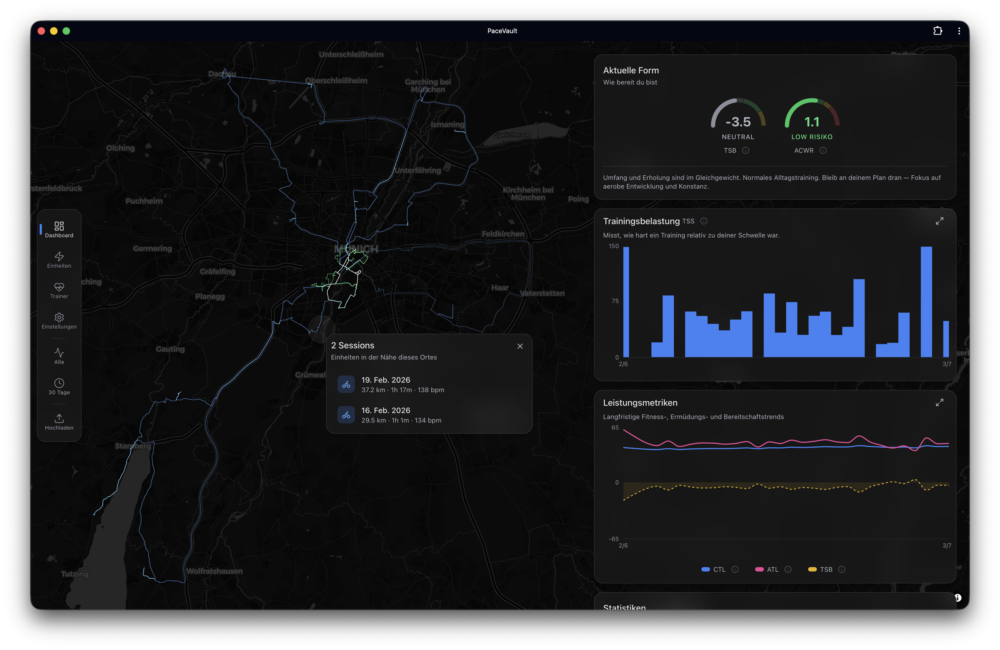

# PaceVault

_Your training. Your device. Your edge._

A local-first endurance training tracker built entirely in the browser. Import Garmin .FIT files, track training load with the Banister impulse-response model, detect personal bests, visualize GPS traces on an interactive map, analyze sessions with advanced metrics (NP, GAP, efficiency, lap analysis), and get coaching recommendations — all without a server.

PaceVault is installable as a Progressive Web App. It works fully offline — once loaded, no network connection is needed. A service worker handles caching and auto-updates in the background. No account, no signup, no server.



## Getting Started

> requires vite+ <https://viteplus.dev/guide/>

1. Fork and clone the repo
2. `vp install && vp dev`
3. Create a branch: `git checkout -b feat/my-thing`
4. Read `CLAUDE.md` for architecture rules before writing code
5. Run the full verification suite before opening a PR:

   ```bash
   vp check                # fmt + lint + typecheck
   vp test -- --run        # unit & integration tests
   vp exec playwright test # e2e tests
   vp build                # production build
   ```

6. Open a PR against `main`
